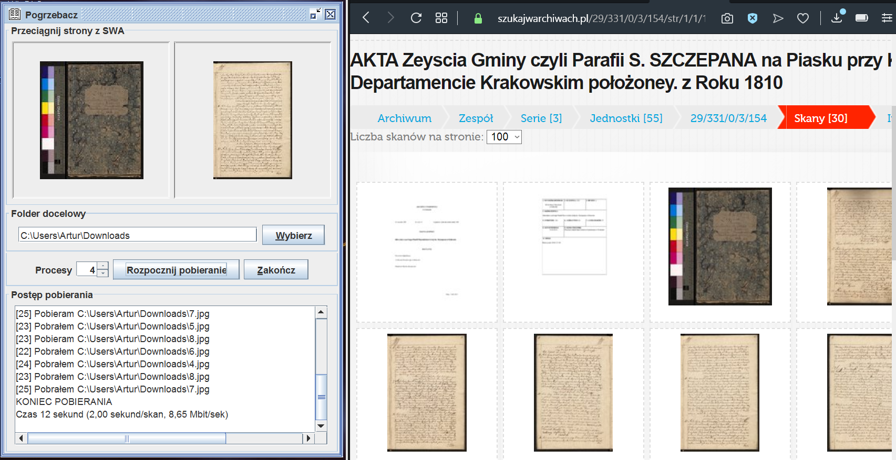

# swing-pogrzebacz

Swing application allows to download metrical books from "Szukaj w Archiwach".

"Szukaj w Archiwach" lacks such functionality, requires downloading page by page only.

Just drag and drop the first and the last page and the application takes the whole book for you.

It uses multithreading for faster downloading.

